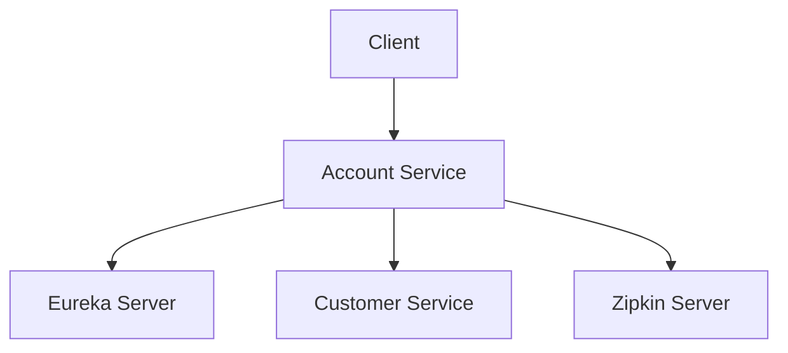

# AccountService

Spring Boot 기반의 마이크로서비스 아키텍처용 계정 관리 서비스입니다. JWT 토큰 기반 인증 시스템과 Feign 클라이언트를 통한 서비스 간 통신을 제공합니다.

## 🏗️ 아키텍처

-   **Spring Boot** 2.1.2
-   **Spring Cloud** Greenwich.RELEASE
-   **Java** 1.8
-   **Maven** 빌드 시스템
-   **Netflix Eureka** 서비스 디스커버리
-   **OpenFeign** 서비스 간 통신
-   **Zipkin & Sleuth** 분산 트레이싱
-   **JWT** 토큰 기반 인증

## 📋 주요 기능

### 1. 인증 서비스 (Token Management)

-   JWT 토큰 생성 및 검증
-   사용자 로그인/인증 처리
-   토큰 기반 세션 관리

### 2. 계정 관리 (Account Management)

-   계정 정보 제공
-   외부 서비스 호출 (Customer Service)
-   성능 테스트용 엔드포인트

### 3. 마이크로서비스 기능

-   Eureka 서비스 디스커버리 등록
-   Feign 클라이언트를 통한 서비스 간 통신
-   분산 트레이싱 (Zipkin/Sleuth)

## 🚀 빠른 시작

### 사전 요구사항

-   Java 1.8 이상
-   Maven 3.6 이상
-   Eureka Server (포트 8761)
-   Zipkin Server (포트 9411)

### 설치 및 실행

1. **프로젝트 클론**

    ```bash
    git clone <repository-url>
    cd AccountService
    ```

2. **의존성 설치**

    ```bash
    ./mvnw clean install
    ```

3. **애플리케이션 실행**

    ```bash
    ./mvnw spring-boot:run
    ```

    또는

    ```bash
    java -jar target/AccountService-0.0.1-SNAPSHOT.jar
    ```

4. **서비스 확인**
    - 애플리케이션: http://localhost:8084
    - Actuator Health: http://localhost:8084/actuator/health

## 📡 API 엔드포인트

### 인증 API (`/token`)

#### 로그인

```http
GET /token/sign?id={username}&pwd={password}
```

**테스트 계정:**

-   `jhlee` / `1234` (ADMIN 권한)
-   `dean` / `1234` (MANAGER 권한)

**응답 예시:**

```json
{
    "code": "100200",
    "msg": "success",
    "data": "eyJhbGciOiJIUzI1NiJ9..."
}
```

#### 토큰 검증

```http
GET /token/verify
Authorization: <JWT_TOKEN>
```

### 계정 API (`/account`)

#### 기본 데이터 조회

```http
GET /account/get-map-data
```

#### 테스트 엔드포인트

```http
GET /account/test
```

#### 성능 테스트 (지연 시뮬레이션)

```http
GET /account/long-time
```

#### Customer Service 호출

```http
GET /account/call-customer
```

## ⚙️ 설정

### application.yml 주요 설정

```yaml
server:
    port: 8084

spring:
    application:
        name: account-service
    zipkin:
        base-url: http://ubuntu-server:9411

eureka:
    client:
        serviceUrl:
            defaultZone: http://localhost:8761/eureka/
```

### JWT 토큰 설정

-   **만료 시간**: 1분 (개발용)
-   **알고리즘**: HS256
-   **시크릿 키**: 환경에 따라 변경 필요

## 🔧 개발 환경 설정

### IDE 설정

-   **Lombok** 플러그인 설치 필요
-   **Java 1.8** 사용

### 로컬 개발을 위한 외부 서비스

1. **Eureka Server** (포트 8761)
2. **Zipkin Server** (포트 9411)
3. **Customer Service** (Feign 클라이언트용)

## 📊 모니터링

### Actuator 엔드포인트

-   Health Check: `/actuator/health`
-   Info: `/actuator/info`
-   Metrics: `/actuator/metrics`

### 분산 트레이싱

-   **Zipkin UI**: http://ubuntu-server:9411
-   모든 요청이 트레이싱됨 (샘플링 확률 100%)

## 🏭 배포

### Docker 배포 (예시)

```bash
# JAR 파일 빌드
./mvnw clean package

# Docker 이미지 생성 (Dockerfile 필요)
docker build -t account-service:latest .

# 컨테이너 실행
docker run -p 8084:8084 account-service:latest
```

### 환경별 설정

-   **개발환경**: `application-dev.yml`
-   **운영환경**: `application-prod.yml`

## 🤝 서비스 의존성



## 📝 API 테스트 예시

### cURL 명령어

```bash
# 로그인
curl -X GET "http://localhost:8084/token/sign?id=dean&pwd=1234"

# 토큰 검증
curl -X GET "http://localhost:8084/token/verify" \
  -H "Authorization: YOUR_JWT_TOKEN"

# 계정 정보 조회
curl -X GET "http://localhost:8084/account/get-map-data"

# Customer Service 호출
curl -X GET "http://localhost:8084/account/call-customer"
```

## 🐛 트러블슈팅

### 자주 발생하는 문제

1. **Eureka 연결 실패**

    - Eureka Server가 실행 중인지 확인
    - `defaultZone` 설정 확인

2. **JWT 토큰 만료**

    - 현재 1분으로 설정되어 있음
    - 운영환경에서는 더 긴 시간으로 설정 필요

3. **Customer Service 호출 실패**
    - Customer Service가 Eureka에 등록되었는지 확인
    - Feign 클라이언트 설정 확인

## 📄 라이센스

이 프로젝트는 [MIT 라이센스](LICENSE) 하에 배포됩니다.
